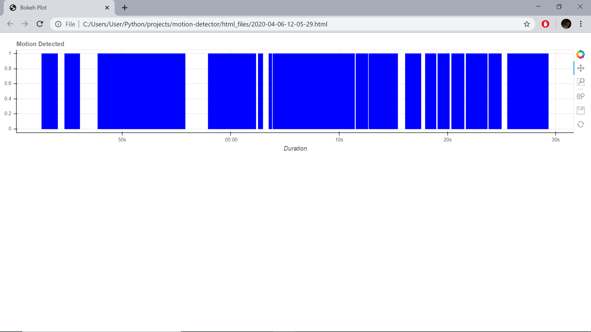

### Webcam Motion Detector
Plots the motion time to a bokeh graph and stores the times to a csv file

# Requirements:
bokeh
pandas

run plotting.py then press q to exit the screen. A csv and html file containing the data will be outputed.

### Screenshot of the graph:

